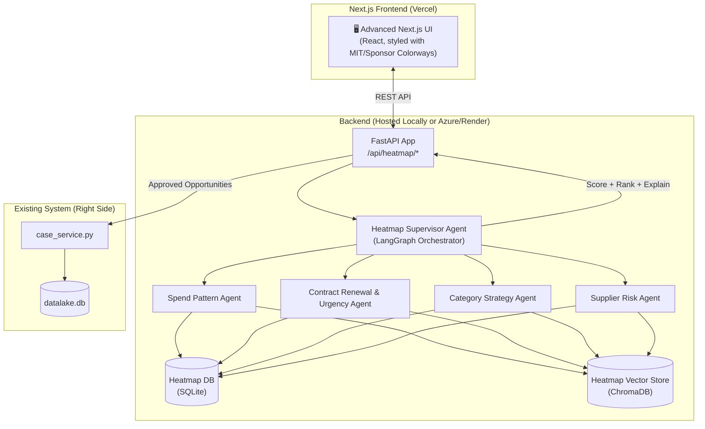

# IT Infrastructure Sourcing Opportunity Heatmap — Implementation Plan

> **See also**: [IMPLEMENTATION_PLAN.md](IMPLEMENTATION_PLAN.md) for cross-cutting roadmap (data quality, concurrency, intent safety, KPI/KLI, pilot backlog). This document remains the **phased build plan** for the heatmap feature itself.

Build a second, independent agentic system (left side of the architecture) that identifies, scores, and ranks renewal and new sourcing opportunities for IT Infrastructure contracts, and feeds approved opportunities into the existing case system (right side) flowing through DTP01 to DTP06.

---

## 1. Goal Description
The purpose of this framework is to prioritize sourcing opportunities within the IT Infrastructure category using enterprise data, focusing on opportunities that create the highest financial value, address risk exposure, and align with category strategy. We are also migrating the UI to Next.js for a more advanced, responsive experience hosted on Vercel, utilizing MIT and Sponsor Colorways.

## 2. User Review Required

> [!IMPORTANT]
> **Data Generation Strategy**: We will create a robust synthetic data generator instead of using the raw "Sample Data" files. This ensures no sensitive data is pushed to GitHub. The generator will mimic the exact schemas of `IT Infra Spend.xlsx`, `IT Infrastructure Contract Data.xlsx`, and `Supplier Metrics Data _ IT Inrastructure.xlsx`.

> [!WARNING]
> **Two Separate Agentic Systems**: The new Opportunity Heatmap Supervisor (prioritization) is **completely independent** from the existing legacy DTP Supervisor (case management). They share **no state or agents**. The only connection is a secure bridge where approved opportunities create cases in the existing legacy system via a simple `create_case()` API call.

> [!WARNING]
> **Minimal Legacy Changes**: The existing legacy system receives only a `create_case()` call when opportunities are approved. There will be **no changes** to existing agents, supervisor, schemas, or database models in the original codebase.

## 3. Architecture Overview



---

## 4. Proposed Changes: Phased Implementation

We will implement this in distinct phases, ensuring the core logic works before finalizing the Next.js UI migration.

### Phase 1: Synthetic Data Generation & Data Layer
Create abstract interfaces for database and vector store access. Generate synthetic data based exactly on the schemas found in the `Sample Data` to avoid using real documents.

#### [NEW] `backend/heatmap/seed_synthetic_data.py`
A robust generator outputting data matching the schemas:
- **Spend**: `['PO Number', 'PO Line', 'PO Date', 'Requisition ID', 'Requisition Date', 'Category', 'Subcategory', 'Supplier Parent', 'Supplier', 'PO Spend (USD)', 'Currency', 'Business Unit', 'Cost Center', 'Requester', 'Description', 'Month', 'Year', 'Payment Terms']`
- **Contracts**: `['Contract ID', 'Contract Title', 'Supplier Parent', 'Supplier', 'Category', 'Subcategory', 'Contract Type', 'Status', 'Effective Date', 'Expiration Date', 'Auto-Renewal', 'Notice Period (Days)', 'TCV (Total Contract Value USD)', 'ACV (Annual Contract Value USD)', 'Business Owner', 'Sourcing Manager', 'Payment Terms', 'SLA Penalties (Y/N)']`
- **Supplier Metrics**: `['Supplier Number', 'Supplier Parent', 'Supplier', 'Site', 'Category', 'Subcategory', 'Sector', 'Region', 'Country', 'State', 'City', 'Spend Tier (USD)', 'Supplier Parent Risk Rating', 'Supplier Risk Score', 'Criticality Risk Level', 'Criticality Risk Score', 'Strategic Risk Score', 'BPRA Security Scorecard', 'BPRA Vendor Status', 'Ethics', 'Labor & Human Rights', 'Resilinc Alerts by Supplier', 'Sanctions, AML+ABC due diligence', 'Environment', 'Supplier Financial Health', 'Sustainable Procurement']`

All data will be generated into `.csv` or `.json` formats within `data/heatmap/synthetic/`.

#### [NEW] `backend/persistence/db_interface.py` & `backend/rag/vector_store_interface.py`
Abstract base classes allowing switching between SQLite/ChromaDB and Azure SQL/Azure AI Search.

#### [NEW] `backend/heatmap/persistence/heatmap_database.py` & `heatmap_models.py`
Separate SQLite models (`data/heatmap.db`) for tracking opportunities, signals, human feedback, weights, and priority tiers.

---

### Phase 2: AI Multi-Agent Scoring Engine (LangGraph)
Implement the Prioritization Framework Formulas:

- **Existing Contracts**: `PS_contract = 0.30(EUS) + 0.25(FIS) + 0.20(RSS) + 0.15(SCS) + 0.10(SAS)`
- **New Requests**: `PS_new = 0.30(IUS) + 0.30(ES) + 0.25(CSIS) + 0.15(SAS)`

#### [NEW] `backend/heatmap/agents/state.py` & `graph.py`
Defines the `HeatmapState` and parallelized `StateGraph` linking the 4 agents to the supervisor.

#### [NEW] Agents (`spend_agent.py`, `contract_agent.py`, `strategy_agent.py`, `risk_agent.py`)
Each agent uses LLMs and heuristics on the synthetic data:
- `contract_agent` calculates Expiry Urgency Score (EUS) and Implementation Urgency Score (IUS).
- `spend_agent` calculates FIS, SCS, ES, and CSIS using category maximums.
- `risk_agent` extracts RSS from the synthetic Supplier Risk data.
- `strategy_agent` evaluates Strategic Alignment Score (SAS).

#### [NEW] `backend/heatmap/agents/supervisor_agent.py`
Aggregates the scores, calculates the final `PS_contract` or `PS_new`, creates explains for each opportunity, and assigns them to Priority Tiers (T1, T2, T3, T4).

---

### Phase 3: APIs, Feedback Loop, and Legacy Case System Integration
Expose the backend logic so a frontend can consume it, and securely link approved cases to the legacy system without disturbing its existing logic.

#### [NEW] `backend/heatmap/heatmap_router.py`
FastAPI routes: `/api/heatmap/run`, `/api/heatmap/run/status`, `/api/heatmap/opportunities`, `/api/heatmap/approve`, `/api/heatmap/feedback`, plus **intake** — `GET /api/heatmap/intake/categories`, `POST /api/heatmap/intake/preview`, `POST /api/heatmap/intake` (persists `Opportunity` with `source=intake`). Batch re-runs replace only `source=batch` rows.

#### [NEW] `backend/heatmap/services/case_bridge.py`
The **only** touchpoint between the new Heatmap system and the legacy DTP system. On approval:
1. Takes the approved opportunity list (with scores + explanations).
2. Formats the payload (Contract ID, Supplier, Category, Action window, etc.).
3. Calls `case_service.create_case()` to create a case in the legacy system with `trigger_source = "OpportunityHeatmap"`.
4. Records the legacy `case_id` mapping in the Heatmap DB audit log.
5. The legacy system then manages the case through DTP01 to DTP06 via its own existing agents. No changes to `case_service.py` are needed.

#### [NEW] `backend/heatmap/services/feedback_service.py` & AI Learning Loop
Handles the crucial human-in-the-loop learning mechanism:
1. **User Input Mechanism**: Within the Next.js UI, the Human can manually adjust the **scoring weights** (e.g., dial down `w_spend` and dial up `w_risk`) OR override the **total score** for a specific opportunity. They are highly encouraged to provide **written feedback** explaining the adjustment (e.g., "Cybersecurity risks are uniquely critical this quarter").
2. **Storage**: This feedback (the delta in score/weight + the written text) is stored structurally in the SQLite `ReviewFeedback` table **and** embedded as text into the ChromaDB Vector Store (`heatmap_documents` collection).
3. **Agentic Learning Loop**: When the Heatmap Supervisor Agent scores future opportunities, it queries the Vector Store for relevant historical feedback. The agent "remembers" the past written context and actively applying those learnings to future recommendations. Additionally, after N feedback loops, the system will recalculate and formally suggest new default weightings (`w_spend`, `w_contract`, etc.) based on aggregate human behavior.

---

### Phase 4: Basic Verification (Backend Output Testing)
Before touching the UI, we verify all scores are mathematically aligned with the framework rules and that cases successfully flow into DTP01 and advance properly. 

*(Wait for manual user check in Swagger UI or via Streamlit scaffolding before building Next.js)*

---

### Phase 5: Advanced Next.js UI Frontend (Final Phase)
Replace the entire Streamlit UI with a unified, separate Next.js web application that serves both the **New Heatmap System** and the **Legacy DTP System**.

#### [NEW FOLDER] `frontend-next/`
A standard Next.js 14+ app layout (App router, React, Tailwind CSS or Vanilla CSS).

- **Colors & Theming**: Employs MIT colorways (Cardinal Red `#A31F34`, Silver Gray `#8A8B8C`) and Sponsor Colorways (Blue `#1a3cff`, Orange `#ff5c35`).
- **Hosting**: Prepared for deployment on Vercel. Connects to the local FastAPI backend during development via environment variables (`NEXT_PUBLIC_API_URL=http://localhost:8000`).

#### Key Pages/Components for the New Heatmap System:
1. **Business Intake Page (`/intake`)**: Form to capture "New Sourcing Requests". Live **PS_new** preview and submit call the FastAPI intake endpoints (same scoring helpers as the framework; see `SYSTEM_DOCUMENTATION.md`).
2. **Prioritized List (`/heatmap`)**: Data table of all scored opportunities (Contracts and New Requests). Shows tier badges, value, and action buttons. 
3. **KPI/KLI Dashboard (`/dashboard/heatmap`)**: Visualizations tracking AI reliability, cycle time reduction, and edit density.
4. **Approval Flow Modal**: Allows bulk selection of opportunities to "Approve & Create Cases", hitting the `/api/heatmap/approve` backend route.

#### Key Pages/Components for the Legacy DTP System:
1. **Case Dashboard (`/cases`)**: Replaces `case_dashboard.py`. Displays all active legacy cases natively in the new Next.js styling, tracking progress through DTP01 to DTP06.
2. **Case Copilot (`/cases/[id]/copilot`)**: Replaces `case_copilot.py`. Provides the chat interface with the Legacy DTP Supervisor, allowing file uploads and interactive AI assistance for case advancement inside the advanced UI.

---

## 5. Verification Plan

### Automated Tests
1. **Formula Verification Tests**: 
   ```bash
   python -m pytest backend/heatmap/tests/test_formulas.py -v
   ```
   *Validates that contract formulas and new request formulas exactly match section 4 & 5 of the Prioritization Framework docx.*

2. **Synthetic Data Validation**:
   ```bash
   python -m pytest backend/heatmap/tests/test_synthetic_data.py -v
   ```
   *Asserts synthetic datasets correctly map all required columns and contain no real data.*

3. **Case Flow Test (DTP)**:
   ```bash
   python -m pytest backend/heatmap/tests/test_case_bridge.py -v
   ```
   *Mocks an approval hit and verifies the opportunity translates successfully from Heatmap to a Case, progressing correctly into the DTP states.*

### Manual Verification
1. Run the local backend: `uvicorn backend.main:app --reload`
2. Generate synthetic data once: `python backend/heatmap/seed_synthetic_data.py`
3. Run the Next.js frontend (in `frontend-next/`): `npm run dev`
4. **Intake Flow**: Go to `http://localhost:3000/intake`, fill out a new request, ensure the live score matches `PS_new`.
5. **Priority Flow**: Go to `/priority`, click "Approve" on a top-tier contract opportunity. Observe the console or UI notification for successful DTP01 creation.
