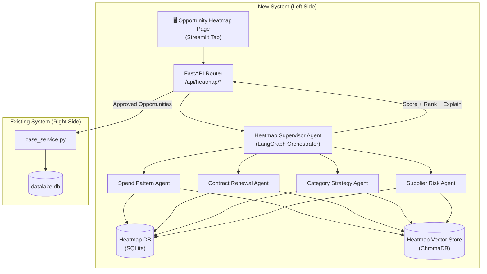

# IT Infrastructure Sourcing Opportunity Heatmap — Implementation Plan

Build a second, independent agentic system (left side of the architecture) that identifies, scores, and ranks renewal opportunities for IT Infrastructure contracts, and feeds approved opportunities into the existing case system (right side).

## User Review Required

> [!IMPORTANT]
> **Two Supervisor Systems**: The new Opportunity Heatmap Supervisor is completely independent from the existing DTP Supervisor. They share **no state**. The only bridge is: approved opportunities create cases in the existing system via [case_service.py](file:///c:/Users/Diandra%20Riando/OneDrive/Documents/Capstone/Cursor%20Code/backend/services/case_service.py).

> [!IMPORTANT]
> **Data Generation Needed**: You mentioned you'll provide sampling data and need help generating seed data. The plan below creates a seed data generator that produces synthetic IT Infrastructure contracts, spend history, risk scores, and strategy data matching the [Synthetic_Sourcing_POC_Data.xlsx](file:///c:/Users/Diandra%20Riando/OneDrive/Documents/Capstone/Cursor%20Code/Synthetic_Sourcing_POC_Data.xlsx) format. We will refine this together.

> [!WARNING]
> **Minimal Legacy Changes**: The existing case system receives only a [create_case()](file:///c:/Users/Diandra%20Riando/OneDrive/Documents/Capstone/Cursor%20Code/frontend/api_client.py#273-311) call when opportunities are approved. No changes to existing agents, supervisor, schemas, or database models.

---

## Architecture Overview



---

## Proposed Changes

### Phase 1: Repository/Adapter Pattern & Data Layer

Establish abstract interfaces for database and vector store access so the entire system can be swapped to Azure SQL + Azure AI Search later.

---

#### [NEW] [db_interface.py](file:///c:/Users/Diandra Riando/OneDrive/Documents/Capstone/Cursor Code/backend/persistence/db_interface.py)

Abstract base class (`DatabaseInterface`) with methods: [get_session()](file:///c:/Users/Diandra%20Riando/OneDrive/Documents/Capstone/Cursor%20Code/backend/persistence/database.py#58-63), `execute_query()`, `init_tables()`. Both the existing [database.py](file:///c:/Users/Diandra%20Riando/OneDrive/Documents/Capstone/Cursor%20Code/backend/persistence/database.py) and the new heatmap DB will implement this. This does **not** modify the existing [database.py](file:///c:/Users/Diandra%20Riando/OneDrive/Documents/Capstone/Cursor%20Code/backend/persistence/database.py) — it wraps it.

#### [NEW] [vector_store_interface.py](file:///c:/Users/Diandra Riando/OneDrive/Documents/Capstone/Cursor Code/backend/rag/vector_store_interface.py)

Abstract base class (`VectorStoreInterface`) with methods: [add_chunks()](file:///c:/Users/Diandra%20Riando/OneDrive/Documents/Capstone/Cursor%20Code/backend/rag/vector_store.py#77-145), [search()](file:///c:/Users/Diandra%20Riando/OneDrive/Documents/Capstone/Cursor%20Code/backend/rag/vector_store.py#146-192), [delete_document()](file:///c:/Users/Diandra%20Riando/OneDrive/Documents/Capstone/Cursor%20Code/backend/main.py#304-314), [count()](file:///c:/Users/Diandra%20Riando/OneDrive/Documents/Capstone/Cursor%20Code/backend/rag/vector_store.py#217-220). The existing [VectorStore](file:///c:/Users/Diandra%20Riando/OneDrive/Documents/Capstone/Cursor%20Code/backend/rag/vector_store.py#38-228) class already matches this shape, so we create the interface and have the existing class inherit from it (minimal change — just adding the base class import).

#### [NEW] [heatmap_database.py](file:///c:/Users/Diandra Riando/OneDrive/Documents/Capstone/Cursor Code/backend/heatmap/persistence/heatmap_database.py)

Separate SQLite database (`data/heatmap.db`) for opportunity data. Implements `DatabaseInterface`. Tables:

| Table | Purpose |
|---|---|
| `opportunities` | Opportunity register (wide table per PRD §11 Dataset 1) |
| `opportunity_signals` | Signal facts (long table per PRD §11 Dataset 2) |
| `review_feedback` | Human feedback (per PRD §11 Dataset 3) |
| `scoring_weights` | Current/historical weight configurations |
| `scoring_runs` | Run metadata (weights used, timestamp, version) |
| `audit_log` | All changes (weights, overrides, approvals) |
| `refresh_schedule` | Periodic refresh configuration |

#### [NEW] [heatmap_models.py](file:///c:/Users/Diandra Riando/OneDrive/Documents/Capstone/Cursor Code/backend/heatmap/persistence/heatmap_models.py)

SQLModel classes for all tables above. Key models:

- `Opportunity`: contract_id, supplier_id, category, subcategory, component scores (spend/contract/strategy/risk), weights used, total_score, tier (P0/P1/P2), rank, recommended_action_window, justification_summary, confidence_level, last_refresh_ts
- `OpportunitySignal`: opportunity_id, signal_name, signal_value, normalized_value, weight, contribution, rule_triggered, evidence_pointer
- `ReviewFeedback`: opportunity_id, reviewer_id, timestamp, adjustment_type (delta/override), adjustment_value, reason_code, comment_text, component_affected
- `ScoringWeights`: run_id, w_spend, w_contract, w_strategy, w_risk, is_suggested (bool), accepted_by_user (bool)
- `ScoringRun`: run_id, timestamp, total_opportunities, weights_snapshot_json
- `AuditLog`: event_type, entity_id, old_value, new_value, user_id, timestamp

#### [NEW] [heatmap_vector_store.py](file:///c:/Users/Diandra Riando/OneDrive/Documents/Capstone/Cursor Code/backend/heatmap/persistence/heatmap_vector_store.py)

Separate ChromaDB collection (`heatmap_documents`) for opportunity-related documents. Implements `VectorStoreInterface`. Uses collection name `heatmap_documents` to avoid conflicts with the existing `sourcing_documents` collection.

#### [NEW] [seed_heatmap_data.py](file:///c:/Users/Diandra Riando/OneDrive/Documents/Capstone/Cursor Code/backend/heatmap/seed_heatmap_data.py)

Generates synthetic IT Infrastructure data matching the [Synthetic_Sourcing_POC_Data.xlsx](file:///c:/Users/Diandra%20Riando/OneDrive/Documents/Capstone/Cursor%20Code/Synthetic_Sourcing_POC_Data.xlsx) format:

- **~15 IT Infra contracts** across subcategories (Cloud Hosting, Network Infrastructure, Data Center, End User Computing, Cybersecurity)
- **Monthly spend records** (12+ months per contract) with trends and volatility
- **Supplier risk scores** (0–100 numeric, mapped from the `Supplier_Risk_Score` 1–5 scale in the sample data)
- **Category strategy objectives** and preferred supplier lists
- All data stored as JSON files in `data/heatmap/` for portability

#### [NEW] [data_loader.py](file:///c:/Users/Diandra Riando/OneDrive/Documents/Capstone/Cursor Code/backend/heatmap/data_loader.py)

Utility to load heatmap seed data from JSON files and Excel, computing derived features (days_to_expiry, spend_trend, spend_volatility, notice_period_status).

---

### Phase 2: LangGraph Multi-Agent System

Build the 5-agent system using LangGraph's `StateGraph` with the Heatmap Supervisor as orchestrator.

---

#### [NEW] [state.py](file:///c:/Users/Diandra Riando/OneDrive/Documents/Capstone/Cursor Code/backend/heatmap/agents/state.py)

LangGraph state definition (`HeatmapState`) — a TypedDict with:
- `contracts`: list of contract dicts to process
- `spend_signals`: agent output from Spend Pattern Agent
- `contract_signals`: agent output from Contract Renewal Agent
- `strategy_signals`: agent output from Category Strategy Agent
- `risk_signals`: agent output from Supplier Risk Agent
- `scored_opportunities`: final scored/ranked list
- `weights`: current weight configuration
- `run_id`: scoring run identifier
- `errors`: list of any processing errors
- `feedback_history`: historical feedback for learning

#### [NEW] [spend_agent.py](file:///c:/Users/Diandra Riando/OneDrive/Documents/Capstone/Cursor Code/backend/heatmap/agents/spend_agent.py)

**Spend Pattern Agent** — For each contract:
1. Loads spend history (12-month)
2. Calls LLM to interpret spend patterns → produces `SpendScore (0-100)` with evidence
3. Returns structured output: score, trend assessment, volatility flag, evidence text

The LLM receives the raw spend data and generates both the normalized score AND the natural-language explanation (e.g., "Spend is $2.5M last 12 months, top decile within IT Infra. Upward trend of 12% suggests growing dependency.").

#### [NEW] [contract_agent.py](file:///c:/Users/Diandra Riando/OneDrive/Documents/Capstone/Cursor Code/backend/heatmap/agents/contract_agent.py)

**Contract Renewal Agent** — For each contract:
1. Calculates days-to-expiry, notice period windows
2. Calls LLM to assess urgency → produces `ContractUrgencyScore (0-100)` with evidence
3. Returns: score, action_window_recommendation, notice_period_status, evidence text

#### [NEW] [strategy_agent.py](file:///c:/Users/Diandra Riando/OneDrive/Documents/Capstone/Cursor Code/backend/heatmap/agents/strategy_agent.py)

**Category Strategy Agent** — For each contract:
1. Loads preferred supplier list and category objectives from strategy data
2. Calls LLM to assess strategic alignment → produces `StrategyScore (0-100)` with evidence
3. Returns: score, preferred_supplier_match (bool), objective_alignment_tags, evidence text

#### [NEW] [risk_agent.py](file:///c:/Users/Diandra Riando/OneDrive/Documents/Capstone/Cursor Code/backend/heatmap/agents/risk_agent.py)

**Supplier Risk Agent** — For each contract:
1. Loads supplier risk score and financial health data
2. Calls LLM to assess risk exposure → produces `RiskScore (0-100)` with evidence
3. Returns: score, risk_category, risk_trend, evidence text

#### [NEW] [supervisor_agent.py](file:///c:/Users/Diandra Riando/OneDrive/Documents/Capstone/Cursor Code/backend/heatmap/agents/supervisor_agent.py)

**Heatmap Supervisor Agent** — Orchestration node that:
1. Collects all 4 agent outputs
2. Computes `Final Score = w_spend * SpendScore + w_contract * ContractUrgencyScore + w_strategy * StrategyScore + w_risk * RiskScore`
3. Applies rule boosts (optional)
4. Assigns priority tiers (P0/P1/P2) using configurable thresholds
5. Calls LLM to generate the final explainability bundle ("why A > B")
6. Incorporates historical feedback corrections if available
7. Returns ranked opportunity list with full explainability

#### [NEW] [graph.py](file:///c:/Users/Diandra Riando/OneDrive/Documents/Capstone/Cursor Code/backend/heatmap/agents/graph.py)

LangGraph `StateGraph` definition:

```
START → load_contracts → [spend_agent, contract_agent, strategy_agent, risk_agent] (parallel) → supervisor_scoring → END
```

The 4 signal agents run in **parallel** (LangGraph fan-out), then the supervisor collects and scores. Supports:
- Full run (all contracts)
- Single contract re-scoring (after feedback)
- Refresh with updated data

#### [NEW] [schemas.py](file:///c:/Users/Diandra Riando/OneDrive/Documents/Capstone/Cursor Code/backend/heatmap/schemas.py)

Pydantic models for:
- `SpendSignal`, `ContractSignal`, `StrategySignal`, `RiskSignal` (agent outputs)
- `ScoredOpportunity` (final output per opportunity)
- `ExplainabilityBundle` (score breakdown + evidence + data freshness)
- `WeightConfig` (w_spend, w_contract, w_strategy, w_risk + thresholds)
- `FeedbackRequest` (adjustment_type, adjustment_value, reason_code, comment)
- `ApprovalRequest` (list of opportunity_ids to approve)

---

### Phase 3: Feedback & Learning Loop

---

#### [NEW] [feedback_service.py](file:///c:/Users/Diandra Riando/OneDrive/Documents/Capstone/Cursor Code/backend/heatmap/services/feedback_service.py)

Handles:
- **Score adjustment storage**: Human can override any component score or total score, with a mandatory reason code + optional free text
- **Reason codes**: `data_issue`, `not_real_opportunity`, `already_in_progress`, `strategic_exception`, `risk_not_applicable`, `scope_misclassified`
- **Bias analysis**: After N feedback entries, computes systematic bias per component (e.g., "users consistently boost StrategyScore by +15 for cybersecurity contracts")
- **Weight suggestion**: Proposes updated default weights for next run based on feedback patterns. User can accept or ignore.
- **Feedback memory**: The LLM agents receive relevant historical feedback when re-scoring, so they learn from past human corrections.

#### [NEW] [refresh_service.py](file:///c:/Users/Diandra Riando/OneDrive/Documents/Capstone/Cursor Code/backend/heatmap/services/refresh_service.py)

- **Manual Refresh**: Button triggers full pipeline re-run, incorporating all feedback
- **Periodic Refresh**: User configures interval (e.g., every 24h). Uses `threading.Timer` or APScheduler for prototype.
- Refresh saves current state as a snapshot before running, enabling version comparison

---

### Phase 4: API Layer

---

#### [NEW] [heatmap_router.py](file:///c:/Users/Diandra Riando/OneDrive/Documents/Capstone/Cursor Code/backend/heatmap/heatmap_router.py)

FastAPI router (`/api/heatmap/`) with endpoints:

| Method | Path | Purpose |
|---|---|---|
| `POST` | `/run` | Trigger full scoring pipeline run |
| `GET` | `/opportunities` | List scored opportunities (filterable) |
| `GET` | `/opportunities/{id}` | Get single opportunity with full explainability |
| `PUT` | `/opportunities/{id}/feedback` | Submit score adjustment + comment |
| `GET` | `/weights` | Get current weight config |
| `PUT` | `/weights` | Update weights |
| `GET` | `/weights/suggested` | Get AI-suggested weights from feedback |
| `POST` | `/approve` | Approve selected opportunities → create cases |
| `GET` | `/runs` | List past scoring runs |
| `GET` | `/runs/{id}` | Get run details + snapshot |
| `POST` | `/refresh` | Manual refresh |
| `PUT` | `/refresh/schedule` | Set periodic refresh interval |
| `GET` | `/audit-log` | Get audit trail |
| `GET` | `/health` | Heatmap subsystem health |

#### [MODIFY] [main.py](file:///c:/Users/Diandra Riando/OneDrive/Documents/Capstone/Cursor Code/backend/main.py)

Add **one line** to include the heatmap router:
```python
from backend.heatmap.heatmap_router import heatmap_router
app.include_router(heatmap_router, prefix="/api/heatmap", tags=["heatmap"])
```

#### [NEW] [heatmap_api_client.py](file:///c:/Users/Diandra Riando/OneDrive/Documents/Capstone/Cursor Code/frontend/heatmap_api_client.py)

Frontend API client for heatmap endpoints. Follows same pattern as existing [api_client.py](file:///c:/Users/Diandra%20Riando/OneDrive/Documents/Capstone/Cursor%20Code/frontend/api_client.py) (supports HTTP and integrated modes).

---

### Phase 5: Frontend (Streamlit)

---

#### [NEW] [opportunity_heatmap.py](file:///c:/Users/Diandra Riando/OneDrive/Documents/Capstone/Cursor Code/frontend/pages/opportunity_heatmap.py)

New Streamlit page with the following sections:

1. **Header & Controls Bar**
   - Refresh button (manual), periodic refresh toggle + interval setting
   - Filter dropdowns: subcategory, supplier, risk band, expiry window, tier
   - Weight adjustment sliders (w_spend, w_contract, w_strategy, w_risk) — live preview

2. **Opportunity Heatmap / Priority List**
   - Table/cards showing ranked opportunities with color-coded tiers (P0 red, P1 amber, P2 green)
   - Columns: Rank, Contract ID, Supplier, Subcategory, Total Score, Tier, Action Window
   - Clickable rows for drill-down

3. **Opportunity Detail Panel** (on click)
   - Score breakdown radar chart (4 components)
   - Evidence & rationale (per-component explanations)
   - Data freshness timestamps
   - Historical score trend (if multiple runs)

4. **Review & Feedback Panel**
   - Score override sliders (per-component or total)
   - Reason code dropdown + free text comment
   - Submit feedback button

5. **Approval Workflow**
   - Checkbox selection for batch approval
   - "Approve & Create Cases" button
   - Approval confirmation with summary of what will be created
   - Version snapshot display

6. **Analytics Sidebar**
   - Feedback summary (total adjustments, common reason codes)
   - Suggested weights (from learning loop) with accept/ignore buttons
   - Run comparison (last run vs this run)

#### [MODIFY] [app.py](file:///c:/Users/Diandra Riando/OneDrive/Documents/Capstone/Cursor Code/frontend/app.py)

Add the Opportunity Heatmap as a new navigation tab:

```diff
 from frontend.pages.case_copilot import render_case_copilot
 from frontend.pages.knowledge_management import render_knowledge_management
+from frontend.pages.opportunity_heatmap import render_opportunity_heatmap

 pages = {
     "dashboard": "Case Dashboard",
     "copilot": "Case Copilot",
-    "knowledge": "Knowledge Management"
+    "knowledge": "Knowledge Management",
+    "heatmap": "🔥 Opportunity Heatmap"
 }

+elif st.session_state.current_page == "heatmap":
+    render_opportunity_heatmap()
```

---

### Phase 6: Case System Integration

---

#### [NEW] [case_bridge.py](file:///c:/Users/Diandra Riando/OneDrive/Documents/Capstone/Cursor Code/backend/heatmap/services/case_bridge.py)

Bridge between heatmap system and existing case system. On approval:
1. Takes the approved opportunity list (with scores + explanations)
2. Formats the integration payload per PRD §10.2 (Contract ID, Supplier, Category, Rationale bundle, Action window)
3. Calls `case_service.create_case()` to create a case in the existing system with `trigger_source = "OpportunityHeatmap"`
4. Records the case_id mapping in the heatmap DB audit log
5. Marks opportunities as "Approved" with version snapshot

This is the **only** touchpoint with the legacy system. No changes to [case_service.py](file:///c:/Users/Diandra%20Riando/OneDrive/Documents/Capstone/Cursor%20Code/backend/services/case_service.py) are needed — it already accepts [CreateCaseRequest](file:///c:/Users/Diandra%20Riando/OneDrive/Documents/Capstone/Cursor%20Code/shared/schemas.py#66-73) with `category_id`, `contract_id`, `supplier_id`, and `trigger_source`.

---

### Phase 7: Project Structure

All new code goes under `backend/heatmap/`:

```
backend/heatmap/
├── __init__.py
├── heatmap_router.py          # FastAPI endpoints
├── schemas.py                 # Pydantic models
├── seed_heatmap_data.py       # Synthetic data generator
├── data_loader.py             # Data loading utilities
├── agents/
│   ├── __init__.py
│   ├── state.py               # LangGraph state
│   ├── graph.py               # LangGraph workflow
│   ├── spend_agent.py
│   ├── contract_agent.py
│   ├── strategy_agent.py
│   ├── risk_agent.py
│   └── supervisor_agent.py
├── persistence/
│   ├── __init__.py
│   ├── heatmap_database.py    # SQLite connection
│   ├── heatmap_models.py      # SQLModel tables
│   └── heatmap_vector_store.py
└── services/
    ├── __init__.py
    ├── feedback_service.py    # Feedback & learning loop
    ├── refresh_service.py     # Manual + periodic refresh
    └── case_bridge.py         # Approved → case creation

backend/persistence/
├── db_interface.py            # NEW: Abstract DB interface
└── (existing files unchanged)

backend/rag/
├── vector_store_interface.py  # NEW: Abstract vector store interface
└── (existing files unchanged)

frontend/
├── heatmap_api_client.py      # NEW: Heatmap API client
└── pages/
    └── opportunity_heatmap.py # NEW: Heatmap Streamlit page

data/heatmap/                  # NEW: Heatmap seed data directory
├── contracts.json
├── spend_history.json
├── supplier_risk.json
├── category_strategy.json
└── preferred_suppliers.json
```

---

## Files Modified in Existing System

Only **2 minimal changes** to existing files:

| File | Change |
|---|---|
| [main.py](file:///c:/Users/Diandra Riando/OneDrive/Documents/Capstone/Cursor Code/backend/main.py) | Add 2 lines: import + `app.include_router()` |
| [app.py](file:///c:/Users/Diandra Riando/OneDrive/Documents/Capstone/Cursor Code/frontend/app.py) | Add heatmap to `pages` dict + routing `elif` (~5 lines) |

Everything else is new files in new directories.

---

## Verification Plan

### Automated Tests

#### 1. Scoring Engine Unit Test
```bash
cd "c:\Users\Diandra Riando\OneDrive\Documents\Capstone\Cursor Code"
python -m pytest backend/heatmap/tests/test_scoring.py -v
```
Tests:
- Weight normalization (weights sum to 1.0)
- Score computation correctness
- Priority tier assignment thresholds
- Edge cases: missing data → "confidence low" flag
- Reproducibility: same inputs + same weights = same rank

#### 2. LangGraph Pipeline Integration Test
```bash
python -m pytest backend/heatmap/tests/test_graph.py -v
```
Tests:
- Full pipeline runs without errors
- All 4 agents produce valid output schemas
- Supervisor correctly aggregates signals
- Parallel agent execution works

#### 3. Feedback Loop Test
```bash
python -m pytest backend/heatmap/tests/test_feedback.py -v
```
Tests:
- Feedback storage and retrieval
- Weight suggestion computation after N adjustments
- Score override persistence
- Audit log creation

#### 4. Case Bridge Integration Test
```bash
python -m pytest backend/heatmap/tests/test_case_bridge.py -v
```
Tests:
- Approved opportunity creates a valid case
- Integration payload matches expected format
- Case appears in existing case list
- Approval snapshot is versioned

### Manual Verification

#### 5. End-to-End UI Test (via browser)
1. Start the app: `streamlit run frontend/app.py`
2. Click "🔥 Opportunity Heatmap" in sidebar
3. Verify opportunity list loads with scored/ranked items
4. Click an opportunity — verify score breakdown and evidence display
5. Adjust a component score via slider, select reason code, type comment, submit
6. Click "Refresh" — verify scores update incorporating feedback
7. Select 2-3 opportunities, click "Approve & Create Cases"
8. Navigate to "Case Dashboard" — verify new cases appear with `trigger_source = "OpportunityHeatmap"`
9. Adjust weights via sliders — verify live re-ranking

> [!NOTE]
> I will perform step 5 via the browser tool to create a screen recording of the workflow.
