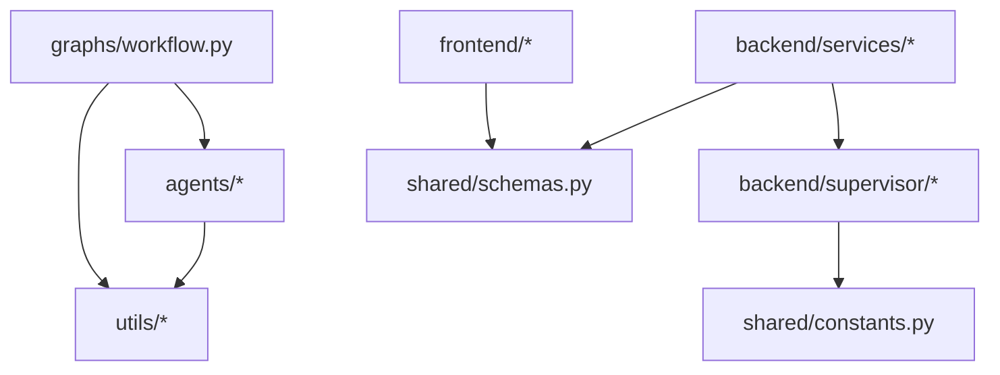

# Import Chain Analysis

## Overview
This document identifies complex import chains in the codebase that may contribute to language server performance issues.

## High-Risk Import Patterns

### 1. graphs/workflow.py (20+ imports)
The main workflow file imports from almost every module:

```
graphs/workflow.py
├── utils/state.py
├── utils/schemas.py (many types)
├── utils/token_accounting.py
├── utils/logging_utils.py
├── utils/caching.py
├── utils/policy_loader.py
├── utils/signal_aggregator.py
├── utils/agent_validator.py
├── utils/contradiction_detector.py
├── utils/case_memory.py
├── utils/execution_constraints.py
├── utils/constraint_compliance.py
├── agents/supervisor.py
├── agents/strategy_agent.py
├── agents/supplier_agent.py
├── agents/negotiation_agent.py
├── agents/signal_agent.py
├── agents/case_clarifier_agent.py
├── agents/rfx_draft_agent.py
├── agents/contract_support_agent.py
└── agents/implementation_agent.py
```

**Risk**: Very deep import tree. If any module has circular dependencies, this is where they manifest.

---

### 2. backend/supervisor/ (Internal Circular Risk)

```
backend/supervisor/__init__.py
├── imports → backend/supervisor/state.py
├── imports → backend/supervisor/router.py
└── imports → backend/supervisor/graph.py

backend/supervisor/graph.py
├── imports → backend/supervisor/state.py
└── imports → backend/supervisor/router.py
```

**Risk**: The `__init__.py` re-exports from submodules, which then import each other. This can create import order issues.

---

### 3. Duplicate Schema Definitions

Two separate schema files define similar types:
- `utils/schemas.py` - Used by agents and workflow
- `shared/schemas.py` - Used by frontend/backend API

**Risk**: Type inconsistency between frontend and backend if schemas drift.

---

## Recommendations

### Short-term
1. ✅ Simplified recursive type annotations (done)
2. Consider lazy imports for heavy modules in `graphs/workflow.py`

### Long-term
1. Consolidate `utils/schemas.py` and `shared/schemas.py` into single source
2. Use `TYPE_CHECKING` guard for type-only imports:
   ```python
   from typing import TYPE_CHECKING
   if TYPE_CHECKING:
       from heavy_module import HeavyType
   ```

---

## Import Dependency Graph



This shows the main import relationships. The `graphs/workflow.py` is the heaviest import hub.
